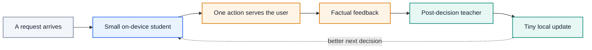
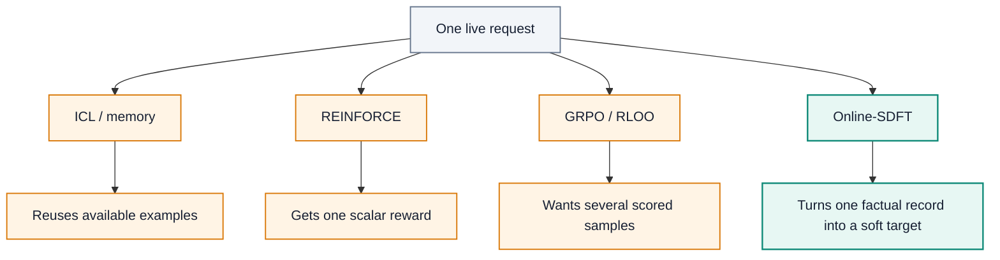
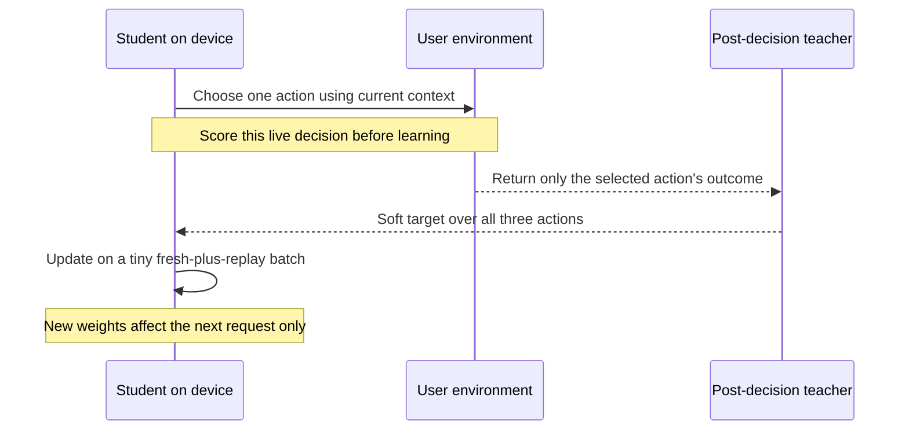

# Learning From the Notification You Did—or Didn’t—Send


*One notification, one executed route, one factual outcome—and a better decision next time.*

> **Draft.** How Online Soft-Distillation Fine-Tuning can help a small on-device model personalize itself from one real interaction at a time.

A notification router has a deceptively hard job. For every message, it must choose whether to interrupt now, save it for later, or archive it. Then it sees only what happened after that choice. If it archives a message, it cannot also observe whether the user would have clicked a push. That alternate outcome never occurred.

This makes notification routing a useful miniature of a larger problem: how can a deployed model keep learning without pretending that it knows counterfactual user behavior?

This post introduces **Online Soft-Distillation Fine-Tuning (Online-SDFT)**. A small student model makes the live decision. After the outcome is observed, a teacher converts the available evidence into a probability distribution over actions. The student performs a tiny update before the next request. There is no train/test split, no ground-truth demonstration, and no second attempt at the same interaction.

## 1. Why streaming learning matters on device

Most models are trained, shipped, and then frozen. But people do not stay frozen. A useful assistant should learn that *this* user silences work chat after 6 p.m., treats family messages as urgent, and changes those preferences while on call.

**Continual learning** simply means that learning continues after deployment. **Personalization** means those updates reflect one person's patterns instead of an average user's. In a stream, every decision matters twice: it serves the user now and becomes evidence for later decisions.



On-device learning is especially attractive because the most useful signals are often local and personal:

| Need | Why the edge helps |
| --- | --- |
| Privacy | Sensitive context and interaction history can remain on the device. |
| Responsiveness | The policy can adapt without a network round trip. |
| Reliability | Decisions and updates can continue while offline. |
| Personal context | The device sees routines that a generic cloud model may never observe. |

The constraint is hardware. Phones and wearables have limited memory, energy, and thermal headroom. Training consumes more memory than inference because it must retain intermediate activations. Work such as [TinyTL](https://arxiv.org/abs/2007.11622) studies this practical bottleneck directly. That is why the learner in an edge system should be small and updates should be brief—often a compact model or a parameter-efficient adapter rather than a full-size cloud model.

The teacher need not always be a larger cloud model. It could be a stronger local model, an occasional cloud service used with consent, or an engineered decision system. The important information boundary is temporal: the teacher can interpret feedback **after** the student acts, but the student cannot use future feedback to choose the current action.

## 2. Why online learning is hard

### One action hides the alternatives

Suppose the router chooses `ARCHIVE`. The factual feedback might be `NO_OBSERVATION`, or the user might later open the inbox organically. It must never fabricate a push click, because no push was sent. Likewise, choosing `INTERRUPT` reveals whether that push was opened, dismissed, or ignored—but not what a later digest would have done.

This is **bandit feedback**: the learner observes the result of its selected action only. It is also **censored** by the action itself.

### Why not just use ICL or memory?

In-context learning (ICL) and retrieval can reuse past examples without changing model weights. That is useful when memory contains strong, relevant examples. It is less useful at the beginning of a new preference or regime: if successful examples are rare, memory cannot invent them. A short context window can also forget older patterns, while an ever-growing store creates latency and retrieval problems.

ICL is therefore a valuable baseline, not a complete continual-learning mechanism. It changes what the model reads, not what the model has learned in its parameters.

### Why not use REINFORCE?

[REINFORCE](https://www.cs.utexas.edu/~shivaram/readings/b2hd-Williams1992.html) updates a policy from sampled actions and scalar rewards. In plain language, it makes rewarded choices more likely and discouraged choices less likely.

That signal can be painfully sparse here. Each live request gives one attempt. If a new user rarely clicks, a reward-only learner may receive long runs of zero or missing reward. Vanilla REINFORCE then has little useful direction and high variance. Negative rewards and good baselines can help, so REINFORCE is not impossible; the problem is that a single scalar discards evidence such as “too noisy,” a dismissal, or prolonged silence in a context where a response was expected.

Silence is not automatically a negative label. It is an ambiguous observation that a teacher can interpret alongside time, category, current action, and history. Online-SDFT's advantage is that its supervision channel can represent that nuance as a soft preference over all actions.

The same channel can use richer feedback when it exists: an explicit comment such as “please stop interrupting me,” a push dismissal, a later organic open, or no response at all. The current demo uses structured outcomes and simulated telemetry rather than free-form comments, but the learning interface is the same: the teacher interprets the evidence; the student learns from the teacher's distribution, never from a hidden ground-truth demonstration.

### Why not generate a group of rollouts?

Methods such as [GRPO](https://arxiv.org/abs/2402.03300) and [RLOO](https://arxiv.org/abs/2402.14740) compare multiple samples for the same prompt to reduce variance or estimate relative advantage. A language model can generate several candidate notification decisions, but the system can execute only one of them. Only that route receives a factual user outcome. Scoring the other candidates as though the user had experienced them would reintroduce the very counterfactual leakage we want to avoid.



| Method | Learns from | Main issue in a one-shot live stream |
| --- | --- | --- |
| ICL / retrieval | Stored examples | Rare successes leave little useful material; weights do not adapt. |
| REINFORCE | One sampled action and scalar reward | Sparse or missing reward gives a weak, high-variance signal. |
| GRPO / RLOO | A group of scored samples | Only one executed route has a factual user outcome. |
| Online-SDFT | One executed route plus a teacher's soft target | Requires a useful, calibrated post-decision teacher. |

## 3. Method: Online-SDFT

### The central rule: act first, learn second

At time `t`, the student sees the current context `x_t` and its past records. It does **not** see privileged information `z_t`, because that information includes the consequence of an action that has not happened yet.

The student samples one action `a_t`. The system executes only that action and records its factual outcome. A teacher then reads the context, action, and newly observed feedback and produces `q_t`: probabilities for `INTERRUPT`, `LATER`, and `ARCHIVE`. The student trains toward that distribution in a tiny batch.




The algorithm is short enough to state directly:

```text
initialize a small student policy and a short replay buffer

for each request x_t in arrival order:
    a_t = sample(student(actions | x_t, past_records))
    record online accuracy and regret before any update

    z_t = execute_only(a_t)                   # factual feedback only
    q_t = teacher(actions | x_t, a_t, z_t)   # never the oracle label

    replay.append((x_t, q_t))
    batch = newest_record + sample(up_to_3_older_records)
    update student once toward q_t
```

The implementation follows this order in [`run_method`](bandit_experiment.py#L257-L326); the post-decision target is built by [`teacher_policy`](bandit_experiment.py#L180-L205).

### How this differs from typical SDFT

Typical soft distillation is an offline recipe: collect a fixed dataset, ask a teacher for probability distributions, train for multiple epochs, and evaluate later. Online-SDFT moves distillation inside the live loop.

| | Typical batch SDFT | Online-SDFT here |
| --- | --- | --- |
| Data | Fixed dataset | One drifting stream |
| Teacher timing | Targets can be precomputed | Target appears after each executed action |
| Student rollout | Often not part of data collection | Student must generate the live action without `z_t` |
| Update | Large shuffled batches, multiple epochs | Fresh record plus at most three replay items |
| Objective | Held-out performance after training | Accuracy and regret while learning |

Online-SDFT also differs from the alternatives in what crosses the learning interface:

| Method | Training message after one request |
| --- | --- |
| ICL | “Store this example for a future prompt.” |
| REINFORCE | “This sampled action earned reward `r_t`.” |
| GRPO / RLOO | “Compare this group of independently scored samples.” |
| Online-SDFT | “Given the one factual outcome, the teacher assigns these probabilities to all actions.” |

That soft distribution matters. A hard target says only “archive.” A soft target might say `ARCHIVE 0.65`, `LATER 0.30`, `INTERRUPT 0.05`. It preserves uncertainty and relative preference, which reduces the variance caused by sampling one teacher answer.

This is not free supervision. The method succeeds only if the teacher is informative and calibrated. In a real product, teacher quality, privacy, failure modes, and compute cost all need explicit evaluation.

## 4. Experiment: a notification router that learns while serving

### Why notification routing?

Notifications are frequent, personal, and asymmetric: one unnecessary interruption can be more costly than one delayed low-priority message. Preferences drift across workdays, on-call periods, and off-hours. Most importantly, the chosen route changes what can be observed. That makes the task both relevant to an on-device assistant and honest about the limits of logged user data.

The demo treats each request as a contextual-bandit round:

| Component | Demo definition |
| --- | --- |
| Context | Message category, time/regime, and available device features |
| Actions | `INTERRUPT`, `LATER`, `ARCHIVE` |
| Feedback | Open/dismiss/ignore push; open/ignore digest; or organic inbox open/no observation |
| Stream | 240 requests: weekday, then on-call, then off-hours |
| Evaluation | Prequential online accuracy and cumulative regret over every action |

There is no train/test split. All methods start fresh on each of 20 paired streams. They choose an action, are scored, receive only action-dependent feedback, and then may update. Six percent exploration is included in the reported metrics rather than removed after the fact.

The evaluator can inspect hidden simulator utilities to calculate regret, but those utilities never become training labels. Regret is the utility of the best action for that simulated context minus the utility of the action actually taken. The [evaluation guide](docs/evaluation.md) gives the exact pseudocode and utility rationale.

### Baselines

The experiment compares five implementations under the same stream and information boundary:

| Method | Implementation in the demo |
| --- | --- |
| Base | Frozen generic linear softmax policy |
| ICL | Blend the base policy with the last 12 sampled teacher actions; no weight update |
| RAG | Retrieve five similar past contexts and vote with sampled teacher actions |
| Online-SFT | Update from one sampled, one-hot teacher action |
| Online-SDFT | Update from the teacher's full action distribution |

REINFORCE, GRPO, and RLOO are conceptual comparisons in this draft, not empirical baselines in the current benchmark.

### Results

The primary numbers are means with 95% confidence intervals over 20 paired streams:

| Method | Online accuracy | Cumulative regret ↓ |
| --- | ---: | ---: |
| Base | 52.17% ± 1.23 | 71.17 ± 2.93 |
| ICL | 45.75% ± 1.05 | 78.38 ± 3.39 |
| RAG | 53.15% ± 1.62 | 56.60 ± 4.39 |
| Online-SFT | 61.79% ± 2.51 | 40.17 ± 4.51 |
| **Online-SDFT** | **74.77% ± 1.24** | **18.65 ± 1.28** |


These are **online** results: the first uncertain decisions count just as much as later ones. Relative to Online-SFT, Online-SDFT gains 12.98 accuracy points and reduces cumulative regret by 21.52 on average. It wins paired online accuracy in all 20 seeds and regret in 19 of 20.

### What learning looks like over time

The stream contains three 80-request regimes. Online-SDFT improves after the early interactions and retains its lead as preferences change:

| Method | Weekday | On-call | Off-hours |
| --- | ---: | ---: | ---: |
| Base | 40.56% | 55.06% | 60.88% |
| ICL | 45.88% | 44.94% | 46.44% |
| RAG | 45.13% | 56.44% | 57.88% |
| Online-SFT | 57.50% | 62.12% | 65.75% |
| **Online-SDFT** | **68.38%** | **77.94%** | **78.00%** |


Three later-stream decisions make the behavior concrete:

| Step | Situation | Online-SDFT | Other methods | What SDFT actually observes |
| ---: | --- | --- | --- | --- |
| 87 | On-call receipt | `ARCHIVE` | Interrupt or defer | `NO_OBSERVATION`; no fictional click |
| 150 | Another on-call receipt | `ARCHIVE` | Interrupt or defer | The selected route's factual outcome only |
| 162 | Off-hours social message | `LATER` | All interrupt | Digest feedback, not push feedback |

The first two examples show why soft evidence can accumulate even when a chosen action produces little visible response. The third shows adaptation to a regime change rather than memorization of a single category rule.

To feel the information constraint yourself, open the [self-contained notebook](online_sdft_bandit_demo.ipynb) and play its short notification-routing game, or [launch it in Colab](https://colab.research.google.com/github/lin826/Online-SFT-Demo/blob/main/online_sdft_bandit_demo.ipynb).

### What this demonstrates—and what it does not

The current student is an intentionally small **linear softmax policy**, not an LLM. The user environment and post-decision teacher are simulated. This makes the causal order auditable and isolates the difference between hard and soft online targets, but it does not yet prove that a phone can safely fine-tune a language model within a real energy budget.

A production-oriented next step would replace the linear student with a small language model or adapter, measure latency/memory/energy, test forgetting and recovery under longer regime shifts, and validate the teacher with consented randomized or prospectively collected interactions. The core contract should remain unchanged: one unprivileged student rollout, one factual outcome, one post-decision teacher target, and one small update that can help only future requests.

That contract is the point. Online learning is not batch training performed more often. It is learning under consequences, where the model must serve the user before it earns the right to learn from what happened.

## Further reading

- Ronald J. Williams, [“Simple Statistical Gradient-Following Algorithms for Connectionist Reinforcement Learning”](https://www.cs.utexas.edu/~shivaram/readings/b2hd-Williams1992.html) (REINFORCE).
- DeepSeek-AI, [“DeepSeekMath: Pushing the Limits of Mathematical Reasoning in Open Language Models”](https://arxiv.org/abs/2402.03300) (GRPO).
- Ahmadian et al., [“Back to Basics: Revisiting REINFORCE Style Optimization for Learning from Human Feedback in LLMs”](https://arxiv.org/abs/2402.14740) (RLOO).
- Cai et al., [“TinyTL: Reduce Memory, Not Parameters for Efficient On-Device Learning”](https://arxiv.org/abs/2007.11622).
