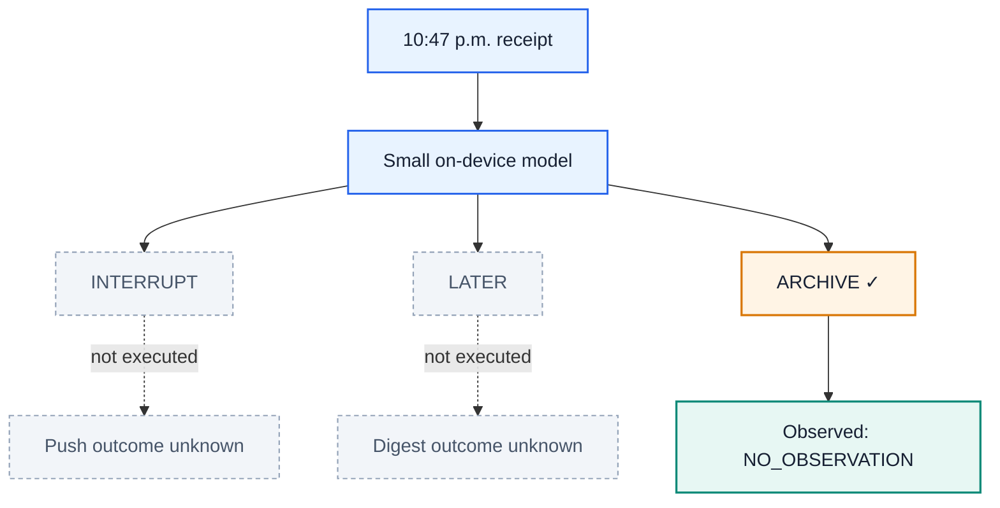

# Learning From the Notification You Did—or Didn’t—Send


*One notification. One real outcome. A better decision next time.*

## Abstract

Personalization does not end when training ends. A deployed assistant keeps
receiving requests, the person keeps changing, and every decision is served to
a real user before anyone knows whether it was right. This post argues that
such continual personalization is best treated as **online learning**—acting,
observing, and updating on one chronological stream—and then shows what that
requires when the environment only reveals the outcome of the action that was
actually taken. We evaluate six adaptation mechanisms on a real
230M-parameter language model and find that **Online-SDFT**, which distills a
post-decision teacher’s full soft distribution into a small adapter, reaches
**64.72% ± 3.14** online accuracy and **36.24 ± 1.66** cumulative regret, while
the strongest frozen baseline reaches **38.75% ± 0.47** and **79.94 ± 7.38**.

> **The idea in one sentence:** a small model acts with the information
> available now; a teacher interprets only what actually happens; a tiny update
> helps future requests.

## 1. Why continual personalization has to be online

Consider what a notification assistant is asked to do. Work chat may be urgent
on call and unwanted at dinner. Family messages may outrank high-importance
work mail. A receipt may deserve a digest today and automatic archiving next
month. These preferences drift, and they drift without announcing themselves.

The default response is a **batch retraining loop**: collect logs, train
offline, freeze the model, ship it, and measure accuracy on a held-out slice.
That loop makes two assumptions that quietly fail here.

The first is that a fixed dataset still describes the user. It does not. Between
retrains the model is frozen while preferences keep moving, so its quality
decays exactly in the window where nobody is measuring.

The second is that a held-out exam measures what matters. It does not. A
held-out score describes decisions the model was graded on afterward, not the
decisions people actually received while the model was still adapting. In
deployment there is no separate exam: every cold-start mistake and every
exploratory action is experienced by someone.

Online learning takes the stream itself as both the training signal and the
evaluation. At round $t$ the learner observes a context $x_t$, acts with the
parameters it has *right now*, and only afterward updates:

$$
a_t \sim \pi_{\theta_t}(\cdot \mid x_t),
\qquad
\theta_{t+1} = \mathrm{Update}\big(\theta_t,\ \text{feedback}_t\big).
$$

Because $a_t$ is produced by $\theta_t$—the parameters *before* this round’s
update—it can be scored honestly the moment it is served. Averaging those
pre-update scores over the stream is **prequential evaluation**:

$$
\mathrm{Acc}(T) \;=\; \frac{1}{T}\sum_{t=1}^{T}\mathbb{1}\!\left[a_t = a_t^{\star}\right],
\qquad
a_t^{\star} \;=\; \arg\max_{a} u_t(a),
$$

and the matching cost measure is **cumulative regret**, the utility lost
relative to the best available route:

$$
\mathcal{R}(T) \;=\; \sum_{t=1}^{T}\Big(\max_{a} u_t(a) \;-\; u_t(a_t)\Big).
$$

These two numbers reward a learner for being useful *during* adaptation, not
merely for being good once adaptation is finished. That is the property
continual personalization actually needs.

Online learning is harder than it sounds, though, and the reason is not
optimization. It is that in a real interaction loop, **the action decides what
evidence can ever exist**.

## 2. One late-night receipt: the action decides the evidence

At 10:47 p.m., a receipt lands on your phone. Should the assistant interrupt
you, put it in tomorrow’s digest, or quietly archive it?

The choice looks simple. Learning from it is not.

If the assistant sends a push, it can observe whether you open, dismiss, or
ignore that push. If it archives the receipt, **there was no push**—so it cannot
later claim that you would have clicked one.

Imagine that the model chooses **ARCHIVE**. The user does not open the inbox
afterward.



What did the model learn? Not “archive was correct,” and not “the user would
have ignored a push.” It learned one factual statement:

> **We archived this receipt, and the user did not go looking for it during the
> observation window.**

That evidence is weak, but it is real. The two alternative outcomes remain
unknown. Formally, the environment reveals only the outcome indexed by the
executed action,

$$
o_t \;=\; o_t\big(a_t\big),
\qquad
\big\{\,o_t(a)\,\big\}_{a \neq a_t} \ \text{is never observed},
$$

which is exactly the structure of a **contextual bandit**:

| In plain English | Bandit term |
| --- | --- |
| The receipt, time, category, and device state | Context $x_t$ |
| Interrupt, later, or archive | Actions $a \in \{A, B, C\}$ |
| What happens after the selected route | Bandit feedback $o_t(a_t)$ |
| The cost of choosing worse than the best route | Regret $\mathcal{R}(T)$ |

So the formulation is not the starting point—it is the consequence. Once you
accept that personalization runs on a live stream, partial feedback follows,
and with it the requirement that the learner never train on an outcome its
action did not cause.

## 3. Why should the learning happen on device?

A generic notification model knows what an average person tends to open. Your
phone needs to learn *you*. Keeping a learner close to the user offers four
practical benefits: private interaction history can stay local, decisions work
offline, updates avoid a network round trip, and the model can use fresh device
context.

The trade-off is compute. Phones have tight memory, energy, and thermal
budgets, and training is more expensive than inference. Research such as
[TinyTL](https://arxiv.org/abs/2007.11622) studies this bottleneck. A realistic
edge learner therefore needs to be small—perhaps a compact language model or a
parameter-efficient adapter—and update in very small batches.

This demo uses
[`LiquidAI/LFM2.5-230M`](https://huggingface.co/LiquidAI/LFM2.5-230M),
a compact causal language model designed for on-device use. Its base weights
stay frozen; REINFORCE, Online-SFT, and Online-SDFT update a rank-4 LoRA adapter
with 172,032 trainable parameters. This is an actual LLM experiment, although
it is still a simulator—not a measurement of phone battery, latency, or thermal
behavior.

The student policy is the softmax over the model’s next-token logits
$\ell_\theta$ restricted to the three single-token action codes:

$$
p_\theta(a \mid x_t) \;=\;
\frac{\exp\!\big(\ell_\theta(a \mid x_t)\big)}
     {\sum_{a' \in \{A,B,C\}} \exp\!\big(\ell_\theta(a' \mid x_t)\big)}.
$$

At serving time the non-RL methods act greedily with a small exploration rate,

$$
a_t \;=\;
\begin{cases}
\arg\max_{a} \, p_{\theta_t}(a \mid x_t), & \text{with probability } 1 - \epsilon,\\[2pt]
\mathrm{Uniform}\{A, B, C\}, & \text{with probability } \epsilon,
\end{cases}
\qquad \epsilon = 0.06,
$$

while REINFORCE samples $a_t \sim p_{\theta_t}(\cdot \mid x_t)$ because its
gradient estimator is on-policy.

The Liquid model is the deployed student. The post-decision teacher in this
controlled experiment is an explicit stochastic simulator policy, chosen so
that readers can audit exactly which facts it uses. It never receives the
evaluator's preferred action or hidden utility vector.

## 4. Why the familiar alternatives struggle

Return to the archived receipt. The only new record is:

```text
receipt at 10:47 p.m. → ARCHIVE → NO_OBSERVATION
```

Several familiar methods can store or score this record, but each throws away
something useful.

| Approach | What it can do with this record | Where the signal gets thin |
| --- | --- | --- |
| ICL / memory | Put the record into a future prompt | It has no successful answer to copy, and model weights do not change. |
| REINFORCE | Update from the chosen action’s scalar reward | Archive silence is reward 0 here, so vanilla reward-only learning gets little direction. |
| GRPO / RLOO | Compare several generated decisions | Only one route can be executed; the other candidates have no factual user outcomes. |
| Online-SDFT | Ask a teacher to interpret the factual record | It still depends on a useful, calibrated teacher. |

These are limitations, not impossibility claims. ICL is excellent when memory contains relevant successes. REINFORCE can learn from negative rewards and variance-reduction baselines. [GRPO](https://arxiv.org/abs/2402.03300) and [RLOO](https://arxiv.org/abs/2402.14740) are effective when multiple samples can be meaningfully scored.

The live interaction is the bottleneck. We can generate eight candidate notification routes, but the user experiences only one. **Eight generated answers are not eight user outcomes.**

Scalar reward is also not the only evidence a user produces. Feedback may be:

- explicit text: “Stop interrupting me for receipts”;
- behavior: open, dismiss, ignore, or revisit later;
- silence: no response during a relevant window.

The current simulator uses structured behavioral outcomes and device telemetry, not free-form user comments. Text feedback is a natural extension of the same teacher interface, not part of the reported experiment.

Silence is ambiguous, not automatically negative. The missing piece is an interpreter that can combine this evidence with context and express uncertainty.

## 5. Online-SDFT: act first, teach second

Online Soft-Distillation Fine-Tuning adds that interpreter as a post-decision **teacher**.


*Panels 1–3 happen while no feedback exists yet; panels 4–5 exist only after the selected route produces an outcome.*

Each round has four steps:

1. **Student acts.** The small student sees the current context and its past. It does not see future feedback or privileged post-decision information.
2. **One route executes.** The environment creates an outcome only for that route.
3. **Teacher interprets.** Afterward, the teacher combines context, the chosen action, factual feedback, and permitted post-decision signals.
4. **Student updates.** One fresh record plus at most three recent records
   update the student for the next request.

The teacher returns a full distribution over routes rather than a single label,

$$
q_t(\cdot) \;=\; \pi_{\text{teacher}}\big(\cdot \mid x_t,\, a_t,\, z_t,\, o_t\big),
\qquad
\sum_{a} q_t(a) = 1,
$$

where $z_t$ is simulator-side state that the student never sees. For the
late-night receipt, an illustrative target might be
$q_t = (0.07,\ 0.31,\ 0.62)$ over $(\textsf{INTERRUPT},\ \textsf{LATER},\ \textsf{ARCHIVE})$:
archive looks best, later remains plausible, and interruption looks costly.

Online-SDFT trains on that whole vector with a soft-target cross-entropy over
the small replay batch $\mathcal{B}_t$:

$$
\mathcal{L}_{\text{SDFT}}(\theta) \;=\;
-\frac{1}{|\mathcal{B}_t|}\sum_{(x,\,q)\in\mathcal{B}_t}\ \sum_{a} q(a)\,\log p_\theta(a \mid x),
$$

which differs from $\mathrm{KL}\big(q \,\|\, p_\theta\big)$ only by a constant
in $\theta$. Online-SFT keeps the same teacher and the same update timing but
first collapses the distribution to a single sampled route:

$$
\tilde a_t \sim q_t,
\qquad
\mathcal{L}_{\text{SFT}}(\theta) \;=\; -\log p_\theta\big(\tilde a_t \mid x_t\big).
$$

REINFORCE never queries the teacher at all. It uses only the scalar factual
reward $r_t$ of the executed route, a past-only EMA baseline, and an entropy
bonus:

$$
\mathcal{L}_{\text{RF}}(\theta) \;=\;
-\Big[(r_t - b_t)\,\log p_\theta(a_t \mid x_t) \;+\; \beta\, H\big(p_\theta(\cdot \mid x_t)\big)\Big],
\qquad
b_{t+1} = b_t + \eta\,(r_t - b_t),
$$

with $\eta = 0.05$ and $\beta = 0.01$. The comparison between
$\mathcal{L}_{\text{SDFT}}$, $\mathcal{L}_{\text{SFT}}$, and
$\mathcal{L}_{\text{RF}}$ is the heart of this study: same model, same stream,
same timing, different amounts of surviving information.

Crucially, the teacher did not observe the two unchosen user outcomes. It is making a recommendation from its prior knowledge and the one factual record—not reading a hidden ground-truth demonstration. The demo’s scoring oracle is sealed away from both teacher and student.

The complete loop is:

```text
initialize student and a short replay buffer

for each request x_t, in arrival order:
    a_t = epsilon_greedy(student(actions | x_t)) # no privileged z_t
    score a_t before learning

    z_t = execute_only(a_t)                      # one factual outcome
    q_t = teacher(actions | x_t, a_t, z_t)       # soft target, not oracle y*

    replay.append((x_t, q_t))
    batch = newest_record + up_to_3_recent_records
    update student once                          # helps t+1, never t
```

The separation is explicit in code:
[environment.py](online_sdft/environment.py) owns the simulated world and
teacher, [methods.py](online_sdft/methods.py) owns the Liquid student and six
algorithms, and [experiment.py](online_sdft/experiment.py) enforces the causal
ordering.

### How is this different from ordinary SDFT?

| Typical batch soft distillation | Online-SDFT in this demo |
| --- | --- |
| Teacher targets exist in a fixed dataset | A target is created after each live action |
| Data can be shuffled for many epochs | Requests arrive once, in order |
| Student rollouts need not collect the data | The student generates every action without privileged feedback |
| Success means held-out accuracy after training | Success means accuracy and low regret while learning |

Online-SFT provides the closest controlled comparison. It uses the same teacher and update timing but samples one hard teacher action. Online-SDFT keeps the full distribution, preserving relative preferences and uncertainty.

## 6. The experiment: learning while serving

Notification routing is a useful test bed because it is personal, preferences drift, interruption has a real cost, and each route reveals different feedback.

The reported LLM experiment runs **3 paired streams**. Each stream contains
**240 requests** across three consecutive regimes:

```text
weekday (80) → on-call (80) → off-hours (80)
```

All six methods see the same streams:

| Method | Adaptation mechanism |
| --- | --- |
| Base | Frozen Liquid LFM2.5-230M |
| ICL | Last 12 teacher samples enter the frozen LFM prompt |
| RAG | 12 nearest past teacher samples enter the frozen LFM prompt |
| REINFORCE | Batch-one LoRA update from factual scalar reward only |
| Online-SFT | LoRA updates from one sampled hard teacher action |
| Online-SDFT | LoRA updates from the full teacher distribution |

The metrics are the prequential pair from Section 1: online accuracy
$\mathrm{Acc}(T)$, measured before each update, and cumulative regret
$\mathcal{R}(T)$ over all 240 decisions.

The hidden utility vector $u_t$ is available to the evaluator because this is a simulator. It is never used as a target or update signal. The [evaluation guide](docs/evaluation.md) gives the exact calculation and explains the utility weights.

### Result: soft online targets learn faster


*Mean over three paired streams; error bars are 95% confidence intervals. Every decision is scored before the model learns from it.*

Online-SDFT reaches **64.72% ± 3.14** online accuracy with **36.24 ± 1.66**
cumulative regret. RAG, the strongest frozen baseline by accuracy, reaches
**38.75% ± 0.47** accuracy and **79.94 ± 7.38** regret.

REINFORCE reaches **32.08% ± 1.70** accuracy and **115.65 ± 16.88** regret.
It increasingly learns to archive: silence often returns reward zero, which is
safer than a noisy negative push or digest reward but can disagree with the
evaluator's fuller utility. REINFORCE cannot use that hidden utility vector.

Relative to Online-SFT, keeping the complete teacher distribution adds
**22.78 accuracy points** and removes **61.41 regret units** on average.
Online-SDFT wins both metrics in all three paired streams. Three seeds make this
a preliminary demonstration, not a production-scale statistical claim.

### Result: the advantage grows during the stream


*Shaded bands mark the three preference regimes. Each point is the running average over the decisions made so far, so early cold-start mistakes stay in the record.*

The blue SDFT curve rises as interactions accumulate while its regret grows much
more slowly. Its phase accuracy moves from **52.50%** during weekday requests to
**63.75%** on call and **77.92%** off hours. These are not held-out test
segments: each point records performance while the model is still adapting.

### Three decisions from the learning trace

**Step 82 — an on-call monitoring incident.** Base, ICL, RAG, and Online-SFT
defer; REINFORCE archives; Online-SDFT interrupts. The push is dismissed. That
single outcome does not retroactively change the fact that the action was
scored before feedback.

**Step 105 — another monitoring incident.** REINFORCE again archives and sees
**NO_OBSERVATION**. Online-SDFT interrupts and receives **OPENED_PUSH**; the
remaining methods defer.

**Step 113 — a third monitoring incident.** Online-SDFT interrupts and receives
**OPENED_PUSH**. The frozen methods and Online-SFT defer, while REINFORCE's
reward-only policy archives and again receives no observation.

These examples show the intended learning trajectory: not memorizing a universal “archive receipts” rule, but accumulating uncertain evidence and adjusting as context changes.

You can experience the information constraint in the [self-contained notebook](online_sdft_bandit_demo.ipynb), which includes a short playable routing game. It also runs directly in [Google Colab](https://colab.research.google.com/github/lin826/Online-SFT-Demo/blob/main/online_sdft_bandit_demo.ipynb).

## 7. What this result does—and does not—show

The experiment shows that, under a strict causal interaction loop, a soft post-decision teacher can train a small policy more effectively than hard teacher samples, short memory, or retrieval.

It does **not** yet show that:

- the teacher will be reliable for real users;
- an LLM can be fine-tuned safely within a phone’s energy budget;
- the simulator’s utility weights match a production notification product;
- exact counterfactual regret can be measured from ordinary deployment logs.

A production study would measure LFM memory, latency, and energy on target phones;
validate the teacher against consented interactions; test longer preference
shifts and forgetting; and use randomized logging or controlled experiments for
evaluation.

The causal contract should remain:

> **Act without privileged information. Observe only what the action caused. Learn from the teacher, not an oracle label. Let the update help only future requests.**

That is the difference between replaying a dataset and genuinely learning online.

## Further reading

- Ronald J. Williams, [“Simple Statistical Gradient-Following Algorithms for Connectionist Reinforcement Learning”](https://www.cs.utexas.edu/~shivaram/readings/b2hd-Williams1992.html) (REINFORCE).
- DeepSeek-AI, [“DeepSeekMath: Pushing the Limits of Mathematical Reasoning in Open Language Models”](https://arxiv.org/abs/2402.03300) (GRPO).
- Ahmadian et al., [“Back to Basics: Revisiting REINFORCE Style Optimization for Learning from Human Feedback in LLMs”](https://arxiv.org/abs/2402.14740) (RLOO).
- Cai et al., [“TinyTL: Reduce Memory, Not Parameters for Efficient On-Device Learning”](https://arxiv.org/abs/2007.11622).
