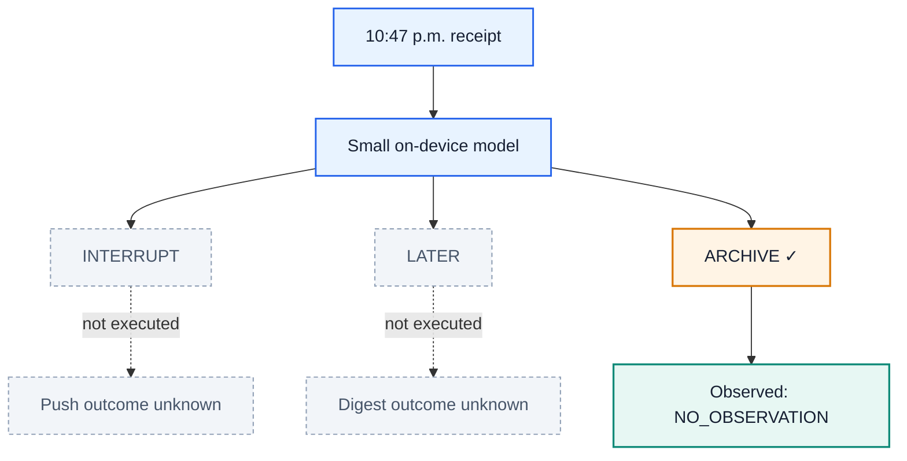
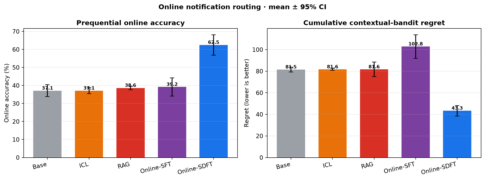
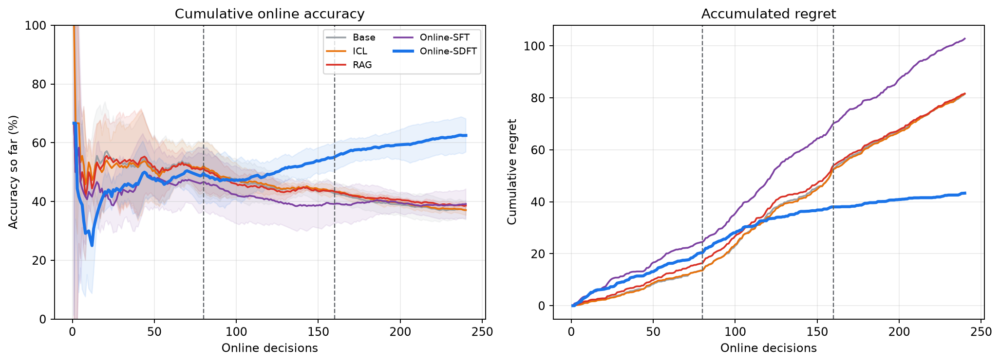

# Learning From the Notification You Did—or Didn’t—Send


*One notification. One real outcome. A better decision next time.*

At 10:47 p.m., a receipt lands on your phone. Should the assistant interrupt you, put it in tomorrow’s digest, or quietly archive it?

The choice looks simple. Learning from it is not.

If the assistant sends a push, it can observe whether you open, dismiss, or ignore that push. If it archives the receipt, **there was no push**—so it cannot later claim that you would have clicked one. The action changes what evidence can exist.

That constraint is the heart of this demo. It is also why online personalization needs a different learning loop from ordinary batch training.

> **The idea in one sentence:** a small model acts with the information available now; a teacher interprets only what actually happens; a tiny update helps future requests.

## 1. Start with one late-night receipt

Imagine that the model chooses **ARCHIVE**. The user does not open the inbox afterward.



What did the model learn? Not “archive was correct,” and not “the user would have ignored a push.” It learned one factual statement:

> **We archived this receipt, and the user did not go looking for it during the observation window.**

That evidence is weak, but it is real. The two alternative outcomes remain unknown.

Machine-learning researchers call this a **contextual bandit**:

| In plain English | Bandit term |
| --- | --- |
| The receipt, time, category, and device state | Context |
| Interrupt, later, or archive | Actions |
| What happens after the selected route | Bandit feedback |
| The cost of choosing worse than the best route | Regret |

The model faces one stream of requests. It acts, receives feedback, updates, and continues. There is no clean training phase followed by a test phase. Every cold-start mistake and every exploratory action affects the user and counts in the final score.

That is what **online learning** means here.

## 2. Why should the learning happen on device?

A generic notification model knows what an average person tends to open. Your phone needs to learn *you*:

- Work chat may be urgent on call and unwanted at dinner.
- Family messages may outrank high-importance work mail.
- A receipt may deserve a digest today and automatic archiving next month.
- These preferences can change without warning.

Keeping a learner close to the user offers four practical benefits: private interaction history can stay local, decisions work offline, updates avoid a network round trip, and the model can use fresh device context.

The trade-off is compute. Phones have tight memory, energy, and thermal budgets, and training is more expensive than inference. Research such as [TinyTL](https://arxiv.org/abs/2007.11622) studies this bottleneck. A realistic edge learner therefore needs to be small—perhaps a compact language model or a parameter-efficient adapter—and update in very small batches.

This demo uses
[`LiquidAI/LFM2.5-230M`](https://huggingface.co/LiquidAI/LFM2.5-230M),
a compact causal language model designed for on-device use. Its base weights stay
frozen; Online-SFT and Online-SDFT update a rank-4 LoRA adapter with 172,032
trainable parameters. This is an actual LLM experiment, although it is still a
simulator—not a measurement of phone battery, latency, or thermal behavior.

The Liquid model is the deployed student. The post-decision teacher in this
controlled experiment is an explicit stochastic simulator policy, chosen so
that readers can audit exactly which facts it uses. It never receives the
evaluator's preferred action or hidden utility vector.

## 3. Why the familiar alternatives struggle

Return to the archived receipt. The only new record is:

```text
receipt at 10:47 p.m. → ARCHIVE → NO_OBSERVATION
```

Several familiar methods can store or score this record, but each throws away something useful.

| Approach | What it can do with this record | Where the signal gets thin |
| --- | --- | --- |
| ICL / memory | Put the record into a future prompt | It has no successful answer to copy, and model weights do not change. |
| REINFORCE | Update from the chosen action’s scalar reward | Archive silence is reward 0 here, so vanilla reward-only learning gets little direction. |
| GRPO / RLOO | Compare several generated decisions | Only one route can be executed; the other candidates have no factual user outcomes. |
| Online-SDFT | Ask a teacher to interpret the factual record | It still depends on a useful, calibrated teacher. |

These are limitations, not impossibility claims. ICL is excellent when memory contains relevant successes. REINFORCE can learn from negative rewards and variance-reduction baselines. [GRPO](https://arxiv.org/abs/2402.03300) and [RLOO](https://arxiv.org/abs/2402.14740) are effective when multiple samples can be meaningfully scored.

The live interaction is the bottleneck. We can generate eight candidate notification routes, but the user experiences only one. **Eight generated answers are not eight user outcomes.**

Scalar reward is also not the only evidence a user produces. Feedback may be:

- explicit text: “Stop interrupting me for receipts”;
- behavior: open, dismiss, ignore, or revisit later;
- silence: no response during a relevant window.

The current simulator uses structured behavioral outcomes and device telemetry, not free-form user comments. Text feedback is a natural extension of the same teacher interface, not part of the reported experiment.

Silence is ambiguous, not automatically negative. The missing piece is an interpreter that can combine this evidence with context and express uncertainty.

## 4. Online-SDFT: act first, teach second

Online Soft-Distillation Fine-Tuning adds that interpreter as a post-decision **teacher**.


*The left side is the live decision; the right side exists only after the selected action produces feedback.*

Each round has four steps:

1. **Student acts.** The small student sees the current context and its past. It does not see future feedback or privileged post-decision information.
2. **One route executes.** The environment creates an outcome only for that route.
3. **Teacher interprets.** Afterward, the teacher combines context, the chosen action, factual feedback, and permitted post-decision signals.
4. **Student updates.** One fresh record plus at most three recent records
   update the student for the next request.

For the late-night receipt, an illustrative teacher target might be:

```text
ARCHIVE    0.62
LATER      0.31
INTERRUPT  0.07
```

This is a **soft target**: a probability distribution rather than a single answer. It tells the student that archive looks best, later remains plausible, and interruption looks costly.

Crucially, the teacher did not observe the two unchosen user outcomes. It is making a recommendation from its prior knowledge and the one factual record—not reading a hidden ground-truth demonstration. The demo’s scoring oracle is sealed away from both teacher and student.

The complete loop is:

```text
initialize student and a short replay buffer

for each request x_t, in arrival order:
    a_t = epsilon_greedy(student(actions | x_t)) # no privileged z_t
    score a_t before learning

    z_t = execute_only(a_t)                      # one factual outcome
    q_t = teacher(actions | x_t, a_t, z_t)       # soft target, not oracle y*

    replay.append((x_t, q_t))
    batch = newest_record + up_to_3_recent_records
    update student once                          # helps t+1, never t
```

This order is enforced in [run_method](bandit_experiment.py), the student's
next-token policy and LoRA update live in
[LiquidLLMPolicy](bandit_experiment.py), and the post-decision distribution is
produced by [teacher_policy](bandit_experiment.py).

### How is this different from ordinary SDFT?

| Typical batch soft distillation | Online-SDFT in this demo |
| --- | --- |
| Teacher targets exist in a fixed dataset | A target is created after each live action |
| Data can be shuffled for many epochs | Requests arrive once, in order |
| Student rollouts need not collect the data | The student generates every action without privileged feedback |
| Success means held-out accuracy after training | Success means accuracy and low regret while learning |

Online-SFT provides the closest controlled comparison. It uses the same teacher and update timing but samples one hard teacher action. Online-SDFT keeps the full distribution, preserving relative preferences and uncertainty.

## 5. The experiment: learning while serving

Notification routing is a useful test bed because it is personal, preferences drift, interruption has a real cost, and each route reveals different feedback.

The reported LLM experiment runs **3 paired streams**. Each stream contains
**240 requests** across three consecutive regimes:

```text
weekday (80) → on-call (80) → off-hours (80)
```

All five methods see the same streams. They normally execute the route with the
highest LFM action-token probability and use 6% uniform exploration:

| Method | Adaptation mechanism |
| --- | --- |
| Base | Frozen Liquid LFM2.5-230M |
| ICL | Last 12 teacher samples enter the LFM prompt |
| RAG | Five similar teacher samples enter the LFM prompt |
| Online-SFT | LoRA updates from one sampled hard teacher action |
| Online-SDFT | LoRA updates from the full teacher distribution |

The metrics are deliberately online:

- **Online accuracy:** was this action the simulator’s best route, measured before feedback?
- **Cumulative regret:** how much simulated utility was lost relative to the best route, summed over all 240 decisions?

The hidden utility vector is available to the evaluator because this is a simulator. It is never used as a target or update signal. The [evaluation guide](docs/evaluation.md) gives the exact calculation and explains the utility weights.

### Result: soft online targets learn faster



*Higher is better on the left; lower is better on the right. Error bars are 95% confidence intervals over paired streams.*

Online-SDFT reaches **62.50% ± 5.66** online accuracy with **43.33 ± 4.81**
cumulative regret. RAG, the strongest frozen baseline by accuracy, reaches
**38.61% ± 0.98** accuracy and **81.63 ± 6.75** regret.

Relative to Online-SFT, keeping the complete teacher distribution adds
**23.33 accuracy points** and removes **59.49 regret units** on average.
Online-SDFT wins both metrics in all three paired streams. Three seeds make this
a preliminary demonstration, not a production-scale statistical claim.

### Result: the advantage grows during the stream



*The dashed lines mark the shifts from weekday to on-call and from on-call to off-hours.*

The blue SDFT curve rises as interactions accumulate while its regret grows much
more slowly. Its phase accuracy moves from **49.58%** during weekday requests to
**60.83%** on call and **77.08%** off hours. These are not held-out test
segments: each point records performance while the model is still adapting.

### Three decisions from the learning trace

**Step 94 — an on-call social item.** Every comparison method defers it;
Online-SDFT archives it. Its factual result is **ORGANIC_INBOX_OPEN**—not a
fictional push or digest click.

**Step 113 — an on-call monitoring incident.** Every comparison method defers
it; Online-SDFT interrupts, and the factual outcome is **OPENED_PUSH**.

**Step 117 — another on-call social item.** Online-SDFT archives and observes an
organic inbox open. Online-SFT interrupts and observes **IGNORED_PUSH**; the
frozen methods defer.

These examples show the intended learning trajectory: not memorizing a universal “archive receipts” rule, but accumulating uncertain evidence and adjusting as context changes.

You can experience the information constraint in the [self-contained notebook](online_sdft_bandit_demo.ipynb), which includes a short playable routing game. It also runs directly in [Google Colab](https://colab.research.google.com/github/lin826/Online-SFT-Demo/blob/main/online_sdft_bandit_demo.ipynb).

## 6. What this result does—and does not—show

The experiment shows that, under a strict causal interaction loop, a soft post-decision teacher can train a small policy more effectively than hard teacher samples, short memory, or retrieval.

It does **not** yet show that:

- the teacher will be reliable for real users;
- an LLM can be fine-tuned safely within a phone’s energy budget;
- the simulator’s utility weights match a production notification product;
- exact counterfactual regret can be measured from ordinary deployment logs.

A production study would measure LFM memory, latency, and energy on target phones;
validate the teacher against consented interactions; test longer preference
shifts and forgetting; and use randomized logging or controlled experiments for
evaluation.

The causal contract should remain:

> **Act without privileged information. Observe only what the action caused. Learn from the teacher, not an oracle label. Let the update help only future requests.**

That is the difference between replaying a dataset and genuinely learning online.

## Further reading

- Ronald J. Williams, [“Simple Statistical Gradient-Following Algorithms for Connectionist Reinforcement Learning”](https://www.cs.utexas.edu/~shivaram/readings/b2hd-Williams1992.html) (REINFORCE).
- DeepSeek-AI, [“DeepSeekMath: Pushing the Limits of Mathematical Reasoning in Open Language Models”](https://arxiv.org/abs/2402.03300) (GRPO).
- Ahmadian et al., [“Back to Basics: Revisiting REINFORCE Style Optimization for Learning from Human Feedback in LLMs”](https://arxiv.org/abs/2402.14740) (RLOO).
- Cai et al., [“TinyTL: Reduce Memory, Not Parameters for Efficient On-Device Learning”](https://arxiv.org/abs/2007.11622).
