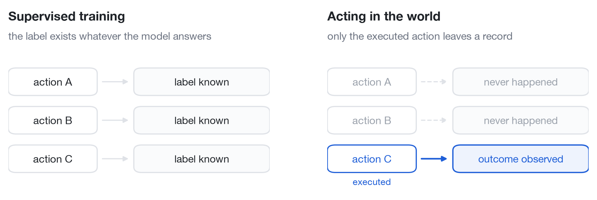

# On-device Online Learning via Self-Distillation


*One notification. One real outcome. A better decision next time.*

## Abstract

Personalization does not end when training ends. A deployed assistant keeps
receiving requests, the person keeps changing, and every decision is served to
a real user before anyone knows whether it was right. This post argues that
such continual personalization is best treated as **online learning**—acting,
observing, and updating on one chronological stream—and then shows what that
requires when the environment only reveals the outcome of the action that was
actually taken. We evaluate six adaptation mechanisms on a real
230M-parameter language model and find that **Online-SDFT**—an online form of
[Self-Distillation Fine-Tuning](https://arxiv.org/abs/2601.19897) (SDFT), which
distills a post-decision teacher’s full soft distribution into a small
adapter—reaches **64.72% ± 3.14** online accuracy and **36.24 ± 1.66**
cumulative regret, while the strongest frozen baseline reaches
**38.75% ± 0.47** and **79.94 ± 7.38**.

> **The idea in one sentence:** a small model acts with the information
> available now; a teacher interprets only what actually happens; a tiny update
> helps future requests.

## 1. Why continual personalization has to be online

Consider what a notification assistant is asked to do. Work chat may be urgent
on call and unwanted at dinner. Family messages may outrank high-importance
work mail. A receipt may deserve a digest today and automatic archiving next
month. These preferences drift, and they drift without announcing themselves.

The default response is a **batch retraining loop**: collect logs, train
offline, freeze the model, ship it, and measure accuracy on a held-out slice.
That loop makes two assumptions that quietly fail here.

The first is that a fixed dataset still describes the user. It does not. Between
retrains the model is frozen while preferences keep moving, so its quality
decays exactly in the window where nobody is measuring.

The second is that a held-out exam measures what matters. It does not. A
held-out score describes decisions the model was graded on afterward, not the
decisions people actually received while the model was still adapting. In
deployment there is no separate exam: every cold-start mistake and every
exploratory action is experienced by someone.

Online learning takes the stream itself as both the training signal and the
evaluation. At round $t$ the learner observes a context $x_t$, acts with the
parameters it has *right now*, and only afterward updates:

$$
a_t \sim \pi_{\theta_t}(\cdot \mid x_t),
\qquad
\theta_{t+1} = \mathrm{Update}\big(\theta_t,\ \text{feedback}_t\big).
$$

Because $a_t$ is produced by $\theta_t$—the parameters *before* this round’s
update—it can be scored honestly the moment it is served. Averaging those
pre-update scores over the stream is **prequential evaluation**:

$$
\mathrm{Acc}(T) \;=\; \frac{1}{T}\sum_{t=1}^{T}\mathbb{1}\!\left[a_t = a_t^{\star}\right],
\qquad
a_t^{\star} \;=\; \arg\max_{a} u_t(a),
$$

and the matching cost measure is **cumulative regret**, the utility lost
relative to the best available route:

$$
\mathcal{R}(T) \;=\; \sum_{t=1}^{T}\Big(\max_{a} u_t(a) \;-\; u_t(a_t)\Big).
$$

These two numbers reward a learner for being useful *during* adaptation, not
merely for being good once adaptation is finished. That is the property
continual personalization actually needs.

What makes it hard is not optimization. It is that a live interaction loop is
stingy about evidence, and it is stingy in a particular way.

## 2. The action decides what evidence exists

A supervised learner is handed a label that exists no matter what the model
answers. A deployed learner is handed something narrower: the consequence of
the one thing it chose to do. Whatever the alternatives would have produced
is never recorded, because the alternatives never happened.



*The supervised loss can compare every option. An interactive loss sees a single row.*

The asymmetry is easiest to see in systems that interrupt people. Send a push
notification and you can observe whether it was opened, dismissed, or ignored.
File the same item into tomorrow’s digest and no push exists, so no click on a
push can ever be logged. Recommenders see engagement only for the items they
surfaced; triage systems see outcomes only for the queue they routed a case to.
In each case the system commits to a kind of evidence before it knows anything.

Formally, the environment reveals only the outcome indexed by the executed
action,

$$
o_t \;=\; o_t\big(a_t\big),
\qquad
\big\{\,o_t(a)\,\big\}_{a \neq a_t} \ \text{is never observed},
$$

which is the standard **contextual bandit** structure:

| In plain English | Bandit term |
| --- | --- |
| Everything known before deciding | Context $x_t$ |
| The available responses | Actions $a \in \{A, B, C\}$ |
| What happened after the chosen one | Bandit feedback $o_t(a_t)$ |
| The cost of not choosing the best one | Regret $\mathcal{R}(T)$ |

Two consequences shape the rest of this post.

**The learner cannot be trained on what it did not do.** Any update that scores
unexecuted alternatives is scoring the model’s own guesses about user
behaviour, not user behaviour.

**The evidence that does arrive is thin and often ambiguous.** Suppose an
assistant archives a low-priority message and the person never goes looking for
it. The record supports one statement—*we archived it, and nothing happened
afterward*—and that statement is compatible with “good call” and with “they
never found out.” Silence is not proof of a correct decision.

So the bandit formulation is not a modelling choice made up front. It is what
remains once personalization runs on a live stream, and it forces a specific
requirement: the learner must never train on an outcome its action did not
cause.

## 3. Why should the learning happen on device?

A generic notification model knows what an average person tends to open. Your
phone needs to learn *you*. Keeping a learner close to the user offers four
practical benefits: private interaction history can stay local, decisions work
offline, updates avoid a network round trip, and the model can use fresh device
context.

The trade-off is compute. Phones have tight memory, energy, and thermal
budgets, and training is more expensive than inference. Research such as
[TinyTL](https://arxiv.org/abs/2007.11622) studies this bottleneck. A realistic
edge learner therefore needs to be small—perhaps a compact language model or a
parameter-efficient adapter—and update in very small batches.

This demo uses
[`LiquidAI/LFM2.5-230M`](https://huggingface.co/LiquidAI/LFM2.5-230M),
a compact causal language model designed for on-device use. Its base weights
stay frozen; REINFORCE, Online-SFT, and Online-SDFT update a rank-4 LoRA adapter
with 172,032 trainable parameters. The requests and user responses come from a
simulator, so what follows measures learning behaviour rather than battery,
latency, or thermal load on real hardware.

The student policy is the softmax over the model’s next-token logits
$\ell_\theta$ restricted to the three single-token action codes:

$$
p_\theta(a \mid x_t) \;=\;
\frac{\exp\!\big(\ell_\theta(a \mid x_t)\big)}
     {\sum_{a' \in \{A,B,C\}} \exp\!\big(\ell_\theta(a' \mid x_t)\big)}.
$$

At serving time the non-RL methods act greedily with a small exploration rate,

$$
a_t \;=\;
\begin{cases}
\arg\max_{a} \, p_{\theta_t}(a \mid x_t), & \text{with probability } 1 - \epsilon,\\[2pt]
\mathrm{Uniform}\{A, B, C\}, & \text{with probability } \epsilon,
\end{cases}
\qquad \epsilon = 0.06,
$$

while REINFORCE samples $a_t \sim p_{\theta_t}(\cdot \mid x_t)$ because its
gradient estimator is on-policy.

The Liquid model is the deployed student. The post-decision teacher is an
explicit stochastic simulator policy whose inputs are written down in code, so
every fact it uses can be checked. It never receives the evaluator’s preferred
action or hidden utility vector.

## 4. Why the familiar alternatives struggle

Return to the archived message. The only new record is:

```text
receipt at 10:47 p.m. → ARCHIVE → NO_OBSERVATION
```

Several familiar methods can store or score this record, but each throws away
something useful.

| Approach | What it can do with this record | Where the signal gets thin |
| --- | --- | --- |
| ICL / memory | Put the record into a future prompt | It has no successful answer to copy, and model weights do not change. |
| REINFORCE | Update from the chosen action’s scalar reward | Archive silence is reward 0 here, so vanilla reward-only learning gets little direction. |
| GRPO / RLOO | Compare several generated decisions | Only one route can be executed; the other candidates have no factual user outcomes. |
| Online-SDFT | Ask a teacher to interpret the factual record | It still depends on a useful, calibrated teacher. |

Each of these methods is strong in its own setting. In-context learning works
well when memory holds relevant successes; REINFORCE learns from informative
rewards and variance-reduction baselines;
[GRPO](https://arxiv.org/abs/2402.03300) and
[RLOO](https://arxiv.org/abs/2402.14740) shine when several samples can be
scored against each other. The bottleneck is the interaction, not the
optimizer: a model can generate eight candidate routes, but the person
experiences one. **Eight generated answers are not eight user outcomes.**

Scalar reward is also not the only evidence a user produces. Feedback may be:

- explicit text: “Stop interrupting me for receipts”;
- behavior: open, dismiss, ignore, or revisit later;
- silence: no response during a relevant window.

The experiments below use structured behavioural outcomes and device telemetry;
free-form text would enter through the same teacher interface.

Silence is ambiguous rather than automatically negative. The missing piece is
an interpreter that can combine thin evidence with context and express its own
uncertainty.

## 5. Online-SDFT: act first, teach second

Self-Distillation Fine-Tuning (SDFT) supplies exactly that kind of interpreter.
In the original formulation of
[Shenfeld et al.](https://arxiv.org/abs/2601.19897)
([project page](https://self-distillation.github.io/SDFT),
[code](https://github.com/idanshen/Self-Distillation),
[TRL trainer](https://huggingface.co/docs/trl/en/sdft_trainer)), a model learns
on-policy from its own teacher: the same network, shown a privileged context
the student does not get, re-scores the student’s output, and that
teacher distribution is distilled back into the student. Learning stays on the
student’s own trajectories, which is what keeps prior capabilities intact.

Online-SDFT applies that idea one round at a time, with the privileged context
being *what happened after the decision*.


*Panels 1–3 happen while no feedback exists yet; panels 4–5 exist only after the selected route produces an outcome.*

Each round has four steps:

1. **Student acts.** The small student sees the current context and its past. It does not see future feedback or privileged post-decision information.
2. **One route executes.** The environment creates an outcome only for that route.
3. **Teacher interprets.** Afterward, the teacher combines context, the chosen action, factual feedback, and permitted post-decision signals.
4. **Student updates.** One fresh record plus at most three recent records
   update the student for the next request.

The teacher returns a full distribution over routes rather than a single label,

$$
q_t(\cdot) \;=\; \pi_{\text{teacher}}\big(\cdot \mid x_t,\, a_t,\, z_t,\, o_t\big),
\qquad
\sum_{a} q_t(a) = 1,
$$

where $z_t$ is simulator-side state that the student never sees. For the
late-night receipt, an illustrative target might be
$q_t = (0.07,\ 0.31,\ 0.62)$ over $(\textsf{INTERRUPT},\ \textsf{LATER},\ \textsf{ARCHIVE})$:
archive looks best, later remains plausible, and interruption looks costly.

Online-SDFT trains on that whole vector with a soft-target cross-entropy over
the small replay batch $\mathcal{B}_t$:

$$
\mathcal{L}_{\text{SDFT}}(\theta) \;=\;
-\frac{1}{|\mathcal{B}_t|}\sum_{(x,\,q)\in\mathcal{B}_t}\ \sum_{a} q(a)\,\log p_\theta(a \mid x),
$$

which differs from $\mathrm{KL}\big(q \,\|\, p_\theta\big)$ only by a constant
in $\theta$. Online-SFT keeps the same teacher and the same update timing but
first collapses the distribution to a single sampled route:

$$
\tilde a_t \sim q_t,
\qquad
\mathcal{L}_{\text{SFT}}(\theta) \;=\; -\log p_\theta\big(\tilde a_t \mid x_t\big).
$$

REINFORCE never queries the teacher at all. It uses only the scalar factual
reward $r_t$ of the executed route, a past-only EMA baseline, and an entropy
bonus:

$$
\mathcal{L}_{\text{RF}}(\theta) \;=\;
-\Big[(r_t - b_t)\,\log p_\theta(a_t \mid x_t) \;+\; \beta\, H\big(p_\theta(\cdot \mid x_t)\big)\Big],
\qquad
b_{t+1} = b_t + \eta\,(r_t - b_t),
$$

with $\eta = 0.05$ and $\beta = 0.01$. The comparison between
$\mathcal{L}_{\text{SDFT}}$, $\mathcal{L}_{\text{SFT}}$, and
$\mathcal{L}_{\text{RF}}$ is the heart of this study: same model, same stream,
same timing, different amounts of surviving information.

The teacher is bound by the same evidence limit as the student: it never sees
the two unchosen outcomes. Its recommendation comes from prior knowledge plus
one factual record, not from a hidden ground-truth demonstration. The scoring
oracle is sealed away from both.

The complete loop is:

```text
initialize student and a short replay buffer

for each request x_t, in arrival order:
    a_t = epsilon_greedy(student(actions | x_t)) # no privileged z_t
    score a_t before learning

    z_t = execute_only(a_t)                      # one factual outcome
    q_t = teacher(actions | x_t, a_t, z_t)       # soft target, not oracle y*

    replay.append((x_t, q_t))
    batch = newest_record + up_to_3_recent_records
    update student once                          # helps t+1, never t
```

The separation is explicit in code:
[environment.py](online_sdft/environment.py) owns the simulated world and
teacher, [methods.py](online_sdft/methods.py) owns the Liquid student and six
algorithms, and [experiment.py](online_sdft/experiment.py) enforces the causal
ordering.

### How this differs from SDFT as published

| SDFT (Shenfeld et al.) | Online-SDFT here |
| --- | --- |
| The teacher is the student itself, conditioned on a demonstration | The teacher is a separate policy, conditioned on the realised outcome |
| Privileged context is an expert demonstration supplied with the data | Privileged context is post-decision feedback the world produced |
| A dataset of prompts can be revisited for many epochs | Each request arrives once, in order, and is answered before it can be studied |
| Success is held-out accuracy after training | Success is accuracy and regret accumulated while learning |

What carries over is the mechanism that matters: distil a full teacher
distribution into the student, on the student’s own trajectories, instead of
fitting a hard target chosen off-policy.

Online-SFT is the closest controlled comparison in this study. It uses the same
teacher and the same update timing but samples one hard teacher action.
Online-SDFT keeps the full distribution, preserving relative preferences and
uncertainty.

## 6. The experiment: learning while serving

Notification routing is a useful test bed because it is personal, preferences drift, interruption has a real cost, and each route reveals different feedback.

The reported LLM experiment runs **3 paired streams**. Each stream contains
**240 requests** across three consecutive regimes:

```text
weekday (80) → on-call (80) → off-hours (80)
```

All six methods see the same streams:

| Method | Adaptation mechanism |
| --- | --- |
| Base | Frozen Liquid LFM2.5-230M |
| ICL | Last 12 teacher samples enter the frozen LFM prompt |
| RAG | 12 nearest past teacher samples enter the frozen LFM prompt |
| REINFORCE | Batch-one LoRA update from factual scalar reward only |
| Online-SFT | LoRA updates from one sampled hard teacher action |
| Online-SDFT | LoRA updates from the full teacher distribution |

The metrics are the prequential pair from Section 1: online accuracy
$\mathrm{Acc}(T)$, measured before each update, and cumulative regret
$\mathcal{R}(T)$ over all 240 decisions.

A simulator can compute the hidden utility vector $u_t$, which is what makes
exact regret measurable at all; no method ever receives it as a target or
update signal. The [evaluation guide](docs/evaluation.md) gives the exact
calculation and explains the utility weights.

### Result: soft online targets learn faster


*Mean over three paired streams; error bars are 95% confidence intervals. Every decision is scored before the model learns from it.*

Online-SDFT reaches **64.72% ± 3.14** online accuracy with **36.24 ± 1.66**
cumulative regret. RAG, the strongest frozen baseline by accuracy, reaches
**38.75% ± 0.47** accuracy and **79.94 ± 7.38** regret.

REINFORCE reaches **32.08% ± 1.70** accuracy and **115.65 ± 16.88** regret.
It increasingly learns to archive: silence often returns reward zero, which is
safer than a noisy negative push or digest reward but can disagree with the
evaluator's fuller utility. REINFORCE cannot use that hidden utility vector.

Relative to Online-SFT, keeping the complete teacher distribution adds
**22.78 accuracy points** and removes **61.41 regret units** on average, and
Online-SDFT wins both metrics in all three paired streams.

### Result: the advantage grows during the stream


*Shaded bands mark the three preference regimes. Each point is the running average over the decisions made so far, so early cold-start mistakes stay in the record.*

The blue SDFT curve rises as interactions accumulate while its regret grows much
more slowly. Its phase accuracy moves from **52.50%** during weekday requests to
**63.75%** on call and **77.92%** off hours. These are not held-out test
segments: each point records performance while the model is still adapting.

### Three decisions from the learning trace

**Step 82 — an on-call monitoring incident.** Base, ICL, RAG, and Online-SFT
defer; REINFORCE archives; Online-SDFT interrupts, and the push is dismissed.
Every one of those decisions was already scored before its outcome arrived.

**Step 105 — another monitoring incident.** REINFORCE again archives and sees
**NO_OBSERVATION**. Online-SDFT interrupts and receives **OPENED_PUSH**; the
remaining methods defer.

**Step 113 — a third monitoring incident.** Online-SDFT interrupts and receives
**OPENED_PUSH**. The frozen methods and Online-SFT defer, while REINFORCE's
reward-only policy archives and again receives no observation.

These examples show the intended learning trajectory: not memorizing a universal “archive receipts” rule, but accumulating uncertain evidence and adjusting as context changes.

You can experience the information constraint in the [self-contained notebook](online_sdft_bandit_demo.ipynb), which includes a short playable routing game. It also runs directly in [Google Colab](https://colab.research.google.com/github/lin826/Online-SFT-Demo/blob/main/online_sdft_bandit_demo.ipynb).

## 7. Scope and limits

Under a strict causal interaction loop, a soft post-decision teacher trains a
small policy more effectively than hard teacher samples, short memory, or
retrieval. That is the claim the experiment supports, over three paired streams
of 240 requests each.

Four things stay open:

- whether a teacher of this quality is available for real users;
- whether an LLM can be fine-tuned inside a phone’s energy and thermal budget;
- whether the simulator’s utility weights resemble a production notification product;
- how to measure counterfactual regret from ordinary deployment logs, where the
  hidden utility vector does not exist.

A production study would measure memory, latency, and energy on target phones;
validate the teacher against consented interactions; test longer preference
shifts and forgetting; and rely on randomized logging or controlled experiments
for evaluation.

The causal contract should remain:

> **Act without privileged information. Observe only what the action caused. Learn from the teacher, not an oracle label. Let the update help only future requests.**

That is the difference between replaying a dataset and genuinely learning online.

## Further reading

- Shenfeld, Damani, Hübotter, and Agrawal, [“Self-Distillation Enables Continual Learning”](https://arxiv.org/abs/2601.19897) — the SDFT method this post adapts. [Project page](https://self-distillation.github.io/SDFT), [reference implementation](https://github.com/idanshen/Self-Distillation), and the [`SDFTTrainer`](https://huggingface.co/docs/trl/en/sdft_trainer) in TRL.
- Ronald J. Williams, [“Simple Statistical Gradient-Following Algorithms for Connectionist Reinforcement Learning”](https://www.cs.utexas.edu/~shivaram/readings/b2hd-Williams1992.html) (REINFORCE).
- DeepSeek-AI, [“DeepSeekMath: Pushing the Limits of Mathematical Reasoning in Open Language Models”](https://arxiv.org/abs/2402.03300) (GRPO).
- Ahmadian et al., [“Back to Basics: Revisiting REINFORCE Style Optimization for Learning from Human Feedback in LLMs”](https://arxiv.org/abs/2402.14740) (RLOO).
- Cai et al., [“TinyTL: Reduce Memory, Not Parameters for Efficient On-Device Learning”](https://arxiv.org/abs/2007.11622).
