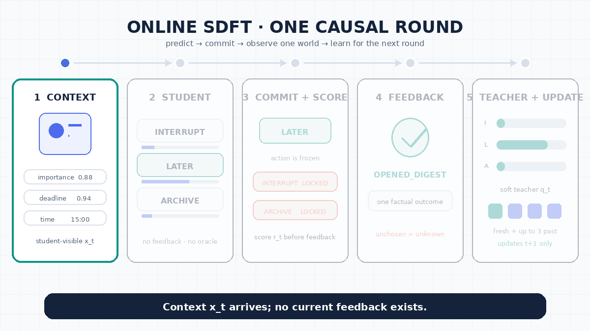

# Online SDFT for Notification Routing

An online contextual-bandit demo for routing notifications as `INTERRUPT`, `LATER`, or `ARCHIVE`. The agent acts before feedback, learns only from the selected action's factual outcome, and is scored on the same drifting stream—there is no train/test split.



## Headline result

Mean over 20 paired 240-event streams; `±` is a 95% confidence interval.

| Method | Online accuracy | Cumulative regret ↓ |
| --- | ---: | ---: |
| Base | 52.17% ± 1.23 | 71.17 ± 2.93 |
| ICL | 45.75% ± 1.05 | 78.38 ± 3.39 |
| RAG | 53.15% ± 1.62 | 56.60 ± 4.39 |
| Online-SFT | 61.79% ± 2.51 | 40.17 ± 4.51 |
| **Online-SDFT** | **74.77% ± 1.24** | **18.65 ± 1.28** |

## Documentation

| Guide | Covers |
| --- | --- |
| [Problem setting](docs/problem-setting.md) | Causal feedback, information boundaries, and online versus batch learning |
| [Methods](docs/methods.md) | Base, ICL, RAG, Online-SFT, and Online-SDFT |
| [Evaluation and regret](docs/evaluation.md) | Exact regret calculation, utility weights, and their limitations |
| [Results and reproduction](docs/results.md) | Protocol, plots, commands, notebook, and artifacts |
| [Blog draft](BLOG.md) | An accessible narrative about continual, on-device learning and Online-SDFT |

## Repository map

| Path | Purpose |
| --- | --- |
| [`run.py`](run.py) | The supported experiment entry point |
| [`bandit_experiment.py`](bandit_experiment.py) | Simulator, five methods, online evaluation, and plots |
| [`online_sdft_bandit_demo.ipynb`](online_sdft_bandit_demo.ipynb) | Self-contained walkthrough and playable game |
| [`build_standalone_notebook.py`](build_standalone_notebook.py) | Rebuilds the notebook and process GIF |
| [`tests/test_bandit_experiment.py`](tests/test_bandit_experiment.py) | Causal-feedback invariants |

## Quick start

```bash
python -m venv .venv
.venv/bin/pip install -r requirements.txt
.venv/bin/python run.py
```

[Open the self-contained notebook](online_sdft_bandit_demo.ipynb) or [launch it in Colab](https://colab.research.google.com/github/lin826/Online-SFT-Demo/blob/main/online_sdft_bandit_demo.ipynb).
