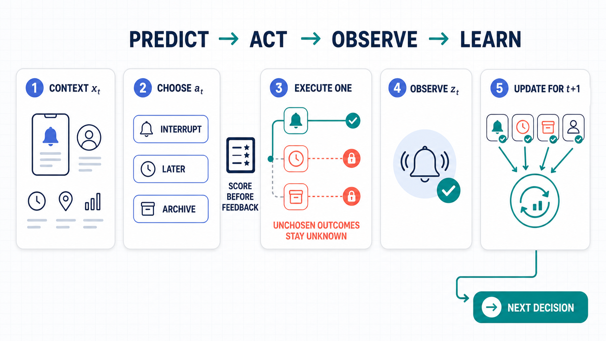

# Online SDFT for Notification Routing

Picture one notification arriving **now**. The system knows its sender, urgency, timing, and the user's history, but it cannot know how the user will react until it chooses what to do. It must route the notification as `INTERRUPT`, `LATER`, or `ARCHIVE`; that choice changes what can be observed next.

That is a contextual bandit, not ordinary labeled classification. The agent repeatedly **predicts, acts, observes one factual outcome, and learns for the future**. It never gets to inspect all three possible futures.



## The contextual-bandit contract

At interaction $t$:

1. A context $x_t$ arrives with information available **before** routing.
2. The student samples an action $a_t \sim \pi_t(\cdot \mid x_t)$, without current feedback or privileged information.
3. The action is recorded and scored immediately. This freezes the online result before learning can occur.
4. The environment executes **only** $a_t$, then returns factual feedback $z_t \sim P(\cdot \mid x_t,a_t)$.
5. A post-decision teacher reads $(x_t,a_t,z_t)$ and returns a soft policy $q_t=\pi_{\mathrm{teacher}}(\cdot \mid x_t,a_t,z_t)$.
6. A tiny online update may change $\pi_{t+1}$. It cannot rewrite the prediction already made at $t$.

The information boundary is the point of the experiment:

| Moment | Learner may use | Learner may **not** use |
| --- | --- | --- |
| Choose $a_t$ | $x_t$, current parameters, past factual records | current $z_t$, future events, oracle action, ground-truth demonstration |
| Observe | outcome caused by the selected $a_t$ | outcomes of either unchosen action |
| Update for $t+1$ | teacher distribution from $(x_t,a_t,z_t)$, small replay batch | simulator oracle, counterfactual user reactions, retroactive correction |
| Evaluate | a sealed scoring oracle computes correctness and regret | oracle output entering any policy or update function |

The scoring oracle is an **experiment instrument**, not a training label. It tells the researcher how costly the committed action was; it is never exposed to Base, ICL, RAG, Online-SFT, Online-SDFT, or the teacher.

> **Mental model:** every event is first a test decision and only afterward can become evidence for later decisions. There is no answer key before acting and no do-over after learning.

## Why the feedback is realistic

Feedback depends on the action actually taken. If the agent chooses `ARCHIVE`, no push or digest exists, so the only possible observations are an organic inbox open or no observation. A push click after `ARCHIVE` would be a fabricated counterfactual, and this simulator never generates one. Likewise, `NO_OBSERVATION` is ambiguous—not secretly converted into a negative ground-truth label.

The stream also drifts from weekday to on-call to off-hours behavior. The agent gets one pass through it, pays for cold start and exploration, and must adapt while serving decisions.

## How this differs from batch learning

| Batch supervised learning | This online contextual bandit |
| --- | --- |
| A fixed dataset contains $(x,y^*)$ labels before training | The stream reveals $x_t$, then feedback only after an action |
| Training can shuffle examples for many epochs | Events arrive once, in order, while user behavior drifts |
| The model is evaluated after training on a held-out split | Every live action is scored before its update |
| A label identifies the desired prediction | Feedback is partial and depends on the chosen action |
| Early training mistakes do not count toward test accuracy | Early mistakes remain in online accuracy and cumulative regret |

There is intentionally no train/test split: the objective is quality **during learning**, measured by prequential online accuracy and cumulative regret over the one stream.

## How regret is calculated

Online accuracy asks whether the chosen route exactly matches the simulator's best route. Regret is more informative: it measures **how much expected user utility the committed action leaves on the table**. Choosing a nearly equivalent route incurs little regret; choosing a harmful route when a much better one exists incurs more.

For evaluation, the simulator has an expected-utility function $\mu_t(a)$ for each action $a \in \mathcal A$. It uses the generated notification attributes and latent user state for round $t$. The scoring-only oracle is

$$
a_t^*=\underset{a \in \mathcal A}{\operatorname{arg\,max}}\;\mu_t(a).
$$

Once the policy commits to $a_t$, its instantaneous regret is

$$
r_t=\mu_t(a_t^*)-\mu_t(a_t) \ge 0.
$$

The experiment accumulates every decision—including cold start and 6% exploration—without resetting after an update:

$$
R_T=\sum_{t=1}^{T} r_t.
$$

### Exact implementation pseudocode

The calculation is split into a simulator-only utility function, the prequential interaction loop, and the across-seed aggregator. The corresponding Python is [`oracle_utilities`](bandit_experiment.py#L141-L152), the [score-before-feedback loop](bandit_experiment.py#L272-L290), the [post-feedback update](bandit_experiment.py#L289-L320), the [per-stream exports](bandit_experiment.py#L322-L340), and the [20-seed aggregation](bandit_experiment.py#L429-L458).

First, the evaluator computes all three expected utilities from the generated event. Let `I`, `D`, `F`, and `B` denote importance, deadline pressure, affinity, and latent busyness; let `C`, `M`, and `S` indicate an on-call incident, manager-focus context, and off-hours social context. This is an exact transcription of [`oracle_utilities`](bandit_experiment.py#L141-L152):

```text
FUNCTION ORACLE_UTILITIES(event):
    I ← event.importance
    D ← event.deadline
    F ← event.affinity
    H ← event.z                              # privileged simulator metadata
    B ← H["busy"]
    C ← H["incident_on_call"]
    M ← H["manager_focus"]
    S ← H["leisure_social"]
    U ← I × D                              # urgency

    μ[INTERRUPT] ← 1.45×U + 0.42×F - 1.20×B
                   + 1.00×C + 0.60×M + 0.50×S

    μ[LATER]     ← 0.72×I + 0.58×F - 0.62×U
                   + 0.22×B - 0.62×C

    μ[ARCHIVE]   ← 0.72×(1-I) + 0.36×(1-F)
                   - 0.80×U - 0.50×S

    RETURN μ
```

Those values are never inserted into the policy prompt, memory, teacher input, or gradient batch. They remain inside the evaluator. The complete per-method, per-seed loop is:

```text
FUNCTION RUN_ONE_STREAM(method, policy, events, seed):
    cumulative_regret ← 0
    cumulative_correct ← 0

    FOR t, event IN events IN ARRIVAL ORDER:
        # 1. Student acts using x_t and past information only.
        p_t ← METHOD_PROBABILITIES(method, policy, event.x, past_memory)
        greedy ← ONE_HOT(ARGMAX(p_t))
        behavior ← (1 - 0.06) × greedy + 0.06 / |ACTIONS|
        a_t ← SAMPLE_CATEGORICAL(behavior)

        # 2. Evaluator freezes and scores that committed action.
        #    No factual outcome has been sampled yet.
        μ_t ← ORACLE_UTILITIES(event)       # evaluator-only hidden state
        a_t_star ← ARGMAX_a μ_t[a]
        r_t ← μ_t[a_t_star] - μ_t[a_t]
        correct_t ← 1 IF a_t = a_t_star ELSE 0

        cumulative_regret ← cumulative_regret + r_t
        cumulative_correct ← cumulative_correct + correct_t
        LOG(t, a_t, r_t, cumulative_regret,
            cumulative_correct / t, a_t_star AS scoring_only)

        # 3. Only now execute a_t and reveal its factual consequence.
        feedback_t ← EXECUTE_SELECTED_ACTION_ONLY(event, a_t)
        q_t ← TEACHER_POLICY(event, a_t, feedback_t)
        teacher_action_t ← SAMPLE_CATEGORICAL(q_t)
        APPEND(past_memory, event.x, teacher_action_t, feedback_t)

        # 4. Update only for future rounds; the score at t is immutable.
        IF method = Online-SFT:
            target ← ONE_HOT(teacher_action_t)
        ELSE IF method = Online-SDFT:
            target ← q_t

        IF method IN [Online-SFT, Online-SDFT]:
            APPEND(replay, (event.x, target))
            KEEP_ONLY_MOST_RECENT_24(replay)
            batch ← [fresh replay item]
                    + RANDOM_SAMPLE(up to 3 older replay items)
            UPDATE(policy, batch)

    RETURN cumulative_regret,
           cumulative_correct / NUMBER_OF_EVENTS,
           cumulative_regret / NUMBER_OF_EVENTS
```

The critical ordering—sample action, compute regret, then obtain feedback—is enforced directly at [`bandit_experiment.py` lines 272–320](bandit_experiment.py#L272-L320). The output stores `step_regret` and `cum_regret` before any update can affect the next action.

Finally, `main` constructs one 240-event stream per seed and reuses those contexts for every method, giving paired comparisons. It summarizes the 20 final stream regrets as follows:

```text
FOR seed IN 0, 1, ..., 19:
    stream ← MAKE_STREAM(seed)
    FOR method IN [Base, ICL, RAG, Online-SFT, Online-SDFT]:
        R[method, seed] ← RUN_ONE_STREAM(method, fresh_policy, stream, seed).regret

FOR method:
    mean_regret[method] ← MEAN(R[method, 0:20])
    sample_std[method]  ← STD_WITH_DDOF_1(R[method, 0:20])
    ci95[method]        ← 1.96 × sample_std[method] / SQRT(20)
```

This matches [`main`](bandit_experiment.py#L429-L458) and [`mean_ci`](bandit_experiment.py#L337-L340). Each method's exploration actions and early mistakes stay in its own $R_{240}$; nothing is discarded or rescored.

### Concrete example

For the first weekday event in seed 0, the Base policy chose `INTERRUPT`. The simulator's sealed expected utilities were:

| Route | Expected utility $\mu_1(a)$ | Role |
| --- | ---: | --- |
| `INTERRUPT` | -0.5499 | policy action |
| `LATER` | 0.8528 | scoring-only oracle action |
| `ARCHIVE` | 0.5100 | unchosen alternative |

Therefore,

$$
r_1=0.8528-(-0.5499)=1.4027.
$$

The environment then executed only `INTERRUPT` and factually observed `IGNORED_PUSH`. It did **not** reveal what the user would have done under `LATER` or `ARCHIVE`. The full utility vector above is used by the benchmark evaluator only; it is never passed to the acting policy, teacher, replay memory, or update function. The selected action's sampled feedback may help the teacher construct $q_t$ for future rounds, but it cannot change $r_t$.

This separation is why the benchmark is not cheating: a simulator may retain all potential expected utilities to grade an agent, just as a game environment retains hidden state, while exposing only action-dependent observations to the learner. Exact regret would not be directly observable in a live notification system. A production study would estimate it through randomized propensity logging, an off-policy estimator, or an online controlled experiment. The realism claim here concerns the **agent's interaction and feedback path**; the complete simulator utility function exists only to make controlled evaluation possible.

Each method receives a cumulative result $R_{240}$ on each of 20 paired streams. The table reports the across-seed mean

$$
\bar R_{240}=\frac{1}{20}\sum_{s=1}^{20}R_{240}^{(s)}
$$

with a 95% confidence interval $\bar R_{240} \pm 1.96\,s_R/\sqrt{20}$. Regret is measured in simulator utility units, not clicks or percentage points. Lower is better; zero would mean selecting the scoring-best route on every round. `outputs/bandit/learning_curves.csv` contains $r_t$ and $R_t$ after every action, while `regret_per_decision` in the seed summaries is $R_{240}/240$.

## Where SDFT fits

The student generates its own rollout from $x_t$ alone. Only after the action and factual feedback does the privileged teacher produce $q_t$. Online-SDFT trains on that complete soft distribution with a small batch; Online-SFT receives only one sampled hard rollout from the same teacher. Neither method trains directly on the simulator's ground-truth action $y^*$.

## Result: one stream, predict then learn

There is no train/test split. Every action is scored before its feedback arrives, then that feedback can be used only for later decisions. Across 20 streams, Online-SDFT reaches **74.77% ± 1.24% online accuracy**, compared with 61.79% for Online-SFT, 53.15% for RAG, 52.17% for Base, and 45.75% for ICL. Its mean cumulative regret is **18.65**, versus 40.17 for the strongest learning baseline.


## Reproduce

```bash
python -m venv .venv
.venv/bin/pip install -r requirements.txt
.venv/bin/python run.py
```

Or open [online_sdft_bandit_demo.ipynb](online_sdft_bandit_demo.ipynb) for the visual walkthrough. The notebook can regenerate all results or inspect the checked-in run artifacts.

[](https://colab.research.google.com/github/lin826/Online-SFT-Demo/blob/main/online_sdft_bandit_demo.ipynb)

## Deliverables

- [TECHNICAL_REPORT.md](TECHNICAL_REPORT.md): formal problem setting, methods, results, and limitations.
- `outputs/bandit/rollouts.jsonl`: every rollout from Base, ICL, RAG, Online-SFT, and Online-SDFT.
- `outputs/bandit/learning_curves.csv`: raw per-step accuracy, cumulative accuracy, regret, and cumulative regret.
- `outputs/bandit/per_seed_metrics.csv`: one summary row per method and seed.
- `outputs/bandit/summary.json`: aggregate means, standard deviations, and confidence intervals.
- `outputs/bandit/qualitative_examples.json`: later-stage cases where SDFT is correct and all comparison arms are not.
- `figures/bandit_*.png`: aggregate, learning-curve, and action-feedback visualizations.
- `figures/contextual_bandit_loop.png`: causal online-interaction illustration used in this README and the notebook.

## Main files

| File | Purpose |
| --- | --- |
| `bandit_experiment.py` | Authoritative fast, multi-seed experiment and artifact generator |
| `online_sdft_bandit_demo.ipynb` | Visual general-audience walkthrough and replication notebook |
| `tests/test_bandit_experiment.py` | Causal feedback, information-boundary, and experiment invariants |

The multi-seed simulator is the primary reported experiment.
